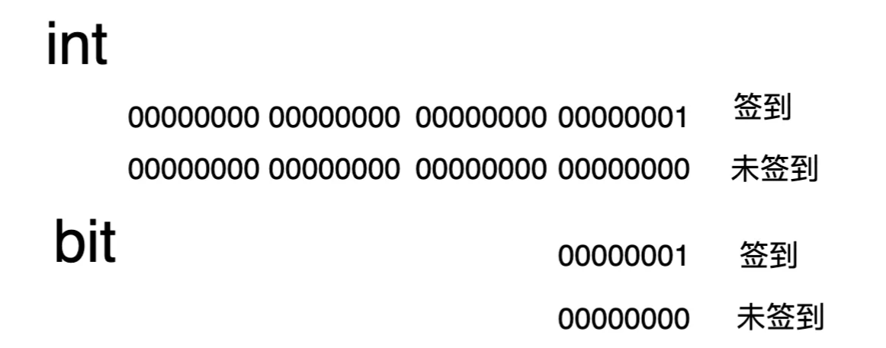
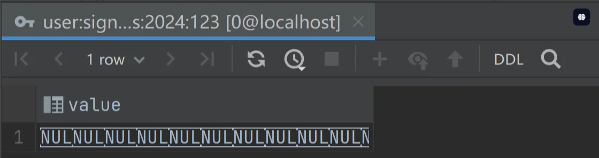
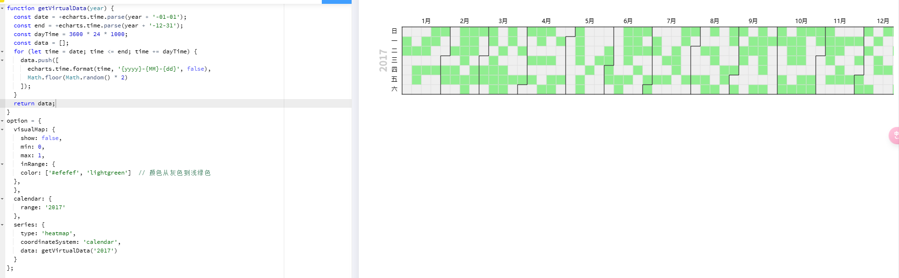
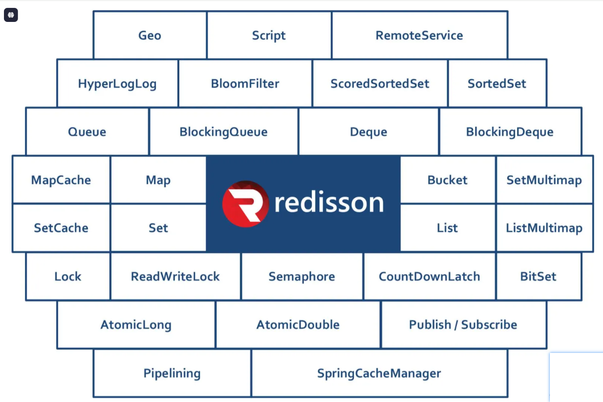

# 用户功能拓展

## 本节重点

面向用户的扩展功能

- 用户刷题记录日历：需求分析 + 方案设计 + 前后端开发 + 性能优化
- 分词题目搜索：需求分析 + 方案设计 + 前后端开发

## 一、用户刷题记录日历

### 需求分析

为了鼓励用户多在网站上刷题，并且能自主复盘学习情况，增加成就感，需要支持用户刷题记录日历功能。

每个用户有自己的签到记录，具体拆解为 2 个子需求：

1. 用户每日首次浏览题目，算作是签到，会记录在系统中。
2. 用户可以在前端以图表的形式查看自己在 **某个年份** 的刷题签到记录（每天是否有签到）。

### 方案设计

后端实现关键在于如何快速存储和获取刷题记录；前端实现关键在于如何展示刷题记录。

#### 后端方案 - 基于数据库

在数据库中设计一张签到表，记录用户每次签到的日期及其他相关信息。然后通过时间范围查询得到用户的签到记录。

示例表结构如下：

```sql
CREATE TABLE user_sign_in (
  id BIGINT AUTO_INCREMENT PRIMARY KEY,  -- 主键，自动递增
  userId BIGINT NOT NULL,               -- 用户ID，关联用户表
  signDate DATE NOT NULL,            -- 签到日期
  createdTime TIMESTAMP DEFAULT CURRENT_TIMESTAMP,  -- 记录创建时间
  UNIQUE KEY uq_user_date (userId, signDate)  -- 用户ID和签到日期的唯一性约束
);
```

通过唯一索引，可以确保同一用户在同一天内只能签到一次。

通过下面的 SQL 即可查询用户的签到记录：

```sql
SELECT signDate FROM user_sign_in 
WHERE userId = ? AND signDate BETWEEN ？AND ?;
```

优点：原理简单，容易实现，适用于用户量较小的系统。

缺点：随着用户量和数据量增大，对数据库的压力增大，直接查询数据库性能较差。除了单接口的响应会增加，可能整个系统都会被其拖垮。

💡 试想一下，每天 1 万个用户签到，1 个月就 30 万条数据，3 个月就接近百万的数据量了，占用硬盘空间大概 50 MB。**存储 100 万个用户 365 天的签到记录，需要 17.52 GB 左右。**

#### 后端方案 - 基于缓存 Redis Set

可以利用内存缓存加速读写，常用的本地缓存是 Caffeine，分布式缓存是 Redis。

由于每个用户会有多个签到记录，很适合使用 Redis 的 Set 类型存储，每个用户对应一个键，Set 内的每个元素为签到的具体日期。

Redis Key 的设计为：`user:signins:{userId}`

其中：

- user 是业务领域前缀
- signins 是具体操作或功能
- {userId} 表示每个用户，是动态值

如果 Redis 被多个项目公用，还可以在开头增加项目前缀区分，比如 `mianshiya:user:signins:{userId}`。

💡 扩展知识：Redis 键设计规范

- 明确性：键名称应明确表示数据的含义和结构。例如，通过使用 `signins` 可以清楚地知道这个键与用户的签到记录有关。
- 层次结构：使用冒号 `:` 分隔不同的部分，可以使键结构化，便于管理和查询。
- 唯一性：确保键的唯一性，避免不同数据使用相同的键前缀。
- 一致性：在整个系统中保持键设计的一致性，使得管理和维护变得更加简单。
- 长度：避免过长的键名称，以防影响性能和存储效率。

具体示例如下，可以使用 Redis 命令行工具添加值到集合中：

```
SADD user:signins:123 "2024-09-01"
SADD user:signins:123 "2024-09-02"
```

使用命令查找集合中的值：

```
SMEMBERS user:signins:123
```

可以利用可视化工具查看和管理 Redis，比如 IDEA 自带的、或者 [RESP](https://github.com/RedisInsight/RedisDesktopManager)：

该方案的优点：Set 数据结构天然支持去重，适合存储和检索打卡记录。

缺点：上述设计显然存储了很多重复的字符串，针对海量数据场景，需要考虑内存的占用量。

比如下列数据：

```
key = user:signins:123
value = ["2024-09-01", "2024-09-02", "2024-10-01", "2024-10-02"]
```

其中，年份被重复存储。

为了减少内存占用，还可以在 key 中增加更多日期层级，比如 `user:signins:{year}:{userId}`。示例命令如下：

```json
SADD user:signins:2024:123 "09-01"
SADD user:signins:2024:123 "10-01"
```

这样一来，不仅节约了内存，也便于管理，可以轻松查询某个用户在某个年份的签到情况。

💡 存储 **100 万个用户** 的 **365 天** 签到记录，使用 Redis 集合类型来存储每个用户的签到信息，每个用户需要大约 **1880 字节** 的空间，总共需要大约 **1.88GB** 的内存空间，相比数据库节约了 10 倍左右。

有没有更节约内存的方式呢？

#### 后端方案 - Bitmap 位图

Bitmap 位图，是一种使用位（bit）来表示数据的 **紧凑** 数据结构。每个位可以存储两个值：0 或 1，常用于表示某种状态或标志。因为每个位仅占用 1 位内存，Bitmap 在大规模存储二值数据（如布尔值）时，非常高效且节约空间。

核心思想：与其存储用户签到的具体日期，不如存储用户在今年的第 N 天是否签到。

```
2024-01-01 => 1（第一天）
2024-01-03 => 3（第三天）
```

使用位图类型存储，每个用户对应一个键，Bitmap 的 **每一位** 来表示用户在 **某一天** 是否打卡。

举个例子，我们签到的状态可以用 0 和 1 表示，0 代表未签到，1 代表签到。

```
0101 表示第 1 天和第 3 天已签到
1010 表示第 2 天和第 4 天已签到
```

如果不用 Bitmap，最传统的方式，我们可以先试着用 int 类型来存储签到状态：

```
int status = 0; // 未签到
int status = 1; // 已签到
```

而 int 类型占用的空间为 4 个字节（byte），一个字节占 8 位（bit），即一个 int 占 32 位。

在这种仅存储二值（0 或 1）的场景，就可以使用 Bitmap 位图来优化存储，因为一个 bit 就可以表示 0 和 1。

把 int 优化成用 bit 存储，那么占用的空间可以优化 32 倍！假设原先占用的大小需要 32 G，那么改造后仅需 1 G。如图：


这里需要注意：现代计算机体系结构通常以字节（8位）作为最小寻址单位，那么上述的 bit 是如何存储的呢？

答案就是 **打包**。

通过将多个 bit 打包到一个字节（或者其他更大的数据类型，如 int、long）中来实现的。每个字节（或数据类型）被视为一个桶，里面可以存放若干个布尔值（0 或 1）。

对每一位操作时，要使用位运算进行访问，所以上述的图实际应该改成：



对于刷题签到记录场景，一个用户存储一年的数据仅需占用 46 字节，因为 46 * 8 = 368，能覆盖 365 天的记录。那一百万用户也才占用 43.8 MB，相比于 Redis Set 结构节约了 40 多倍存储空间！

1000w 个用户也才占用 438 MB！恭喜你，设计出了一个低成本支持千万用户的系统！

当然，我们没必要自己通过 int 等类型实现 Bitmap，JDK 自带了 BitSet 类、Redis 也支持 Bitmap 高级数据结构。考虑到项目的分布式、可扩展性，采用 Redis 的 Bitmap 实现。

Redis Key 的设计为：`user:signins:{年份}:{userId}`

设置某一个 bit 值的命令如下：

```
-- 表示用户在第 240 天打卡
SETBIT user:signins:2024:123 240 1
-- 表示用户在第 241 天打卡
SETBIT user:signins:2024:123 241 1
```

查询某一个 bit 值的命令：

```
GETBIT user:signins:2024:123 240
```

在 Java 程序中，还可以使用 Redisson 库提供的现成的 RBitSet，开发成本也很低。

这种方案的优点：内存占用极小，适合大规模用户和日期的场景。

缺点：需要熟悉位图操作，不够直观。



但这个缺点无关痛痒，因此本项目采用这种方案实现。

总结一下：

- 基于性能的考虑，我们选用 Redis 中间件来存储用户的签到记录。
- 基于空间的考虑，我们选用 Bitmap 数据结构来存储用户的签到记录。

#### 前端方案

要明确前端展示签到记录日历所需的数据类型，后端才好设计接口的返回值，因此方案设计阶段要考虑全面。

复杂的展示组件肯定不用自己开发，只要是图表（可视化），就可以优先考虑使用 Apache ECharts 前端可视化库，有 3 种可行的组件：

1. 基础日历图：https://echarts.apache.org/examples/zh/editor.html?c=calendar-simple
2. 日历热力图：https://echarts.apache.org/examples/zh/editor.html?c=calendar-heatmap，跟上一个图的区别就是鼠标放上去可以展示具体的热力值，热力值越高，图块的颜色越深。
3. 日历图：https://echarts.apache.org/examples/zh/editor.html?c=calendar-charts

本项目选择基础日历图即可，不涉及热力数值的区分（只有 0 和 1 签到 / 未签到的区别）：

```js
visualMap: {
  show: false,
    min: 0,
    max: 1,
    inRange: {
    color: ['#efefef', 'lightgreen']  // 颜色从灰色到浅绿色
  },
},
```



### 后端开发

需要开发 2 个接口：

1. 添加刷题签到记录
2. 查询刷题签到记录

在此之前，需要先引入 Redisson 依赖，以实现 Bitmap 存储。

#### 1、引入 Redisson

[Redisson](https://github.com/redisson/redisson) 是一个基于 Redis 的开源分布式 Java 数据库客户端，提供了类似 Java 标准库的数据结构（如 Map、Set、List、BitSet 等）在分布式环境下的实现。它不仅支持基本的 Redis 操作，还提供了高级功能，如分布式锁、同步器、限流器、缓存等，简化了在分布式系统中使用 Redis 进行数据共享和并发控制的复杂性。



1.在 pom.xml 文件中引入 Redisson：

```xml
<dependency>
  <groupId>org.redisson</groupId>
  <artifactId>redisson</artifactId>
  <version>3.21.0</version>
</dependency>
```

2.在 config 目录下编写 Redisson 客户端配置类，会自动读取项目中的 Redis 配置，初始化客户端 Bean。代码如下：

```java
@Configuration
@ConfigurationProperties(prefix = "spring.redis")
@Data
public class RedissonConfig {

    private String host;

    private Integer port;

    private Integer database;

    private String password;

    @Bean
    public RedissonClient redissonClient() {
        Config config = new Config();
        config.useSingleServer()
        .setAddress("redis://" + host + ":" + port)
        .setDatabase(database)
        .setPassword(password);
        return Redisson.create(config);
    }
}
```

3.项目的 yml 配置文件中补充 Redis 配置，没有密码就可以注释掉：

```
# Redis 配置
spring:
  redis:
    database: 0
    host: xxxx
    port: xxx
    timeout: 2000
    password: xxx
```

然后尝试启动项目。如果用的是编程导航的万用后端模板，**记得取消启动类对 Redis 的移除**。

#### 2、添加刷题签到记录接口

触发时机：已登录用户进入题目详情页时，调用接口，触发签到。

接口逻辑：判断目前用户当天是否签到

- 如果已签到，则忽略
- 如果未签到，则在 Bitmap 中设置记录

1）因为读写 Redis 使用的是相同的 key，可以将所有 Redis 的 key 单独定义成常量，放在 constant 目录下，还可以提供拼接完整 key 的方法。代码如下：

```java
public interface RedisConstant {

    /**
     * 用户签到记录的 Redis Key 前缀
     */
    String USER_SIGN_IN_REDIS_KEY_PREFIX = "user:signins";

    /**
     * 获取用户签到记录的 Redis Key
     * @param year 年份
     * @param userId 用户 id
     * @return 拼接好的 Redis Key
     */
    static String getUserSignInRedisKey(int year, long userId) {
        return String.format("%s:%s:%s", USER_SIGN_IN_REDIS_KEY_PREFIX, year, userId);
    }

}
```

2）在 UserService 中编写接口：

```java
/**
 * 添加用户签到记录
 *
 * @param userId 用户 id
 * @return 当前是否已签到成功
 */
boolean addUserSignIn(long userId);
```

编写实现类：

```java
/**
 * 添加用户签到记录
 *
 * @param userId 用户签到
 * @return 当前是否已签到成功
 */
public boolean addUserSignIn(long userId) {
    LocalDate date = LocalDate.now();
    String key = RedisConstant.getUserSignInRedisKey(date.getYear(), userId);
    RBitSet signInBitSet = redissonClient.getBitSet(key);
    // 获取当前日期是一年中的第几天，作为偏移量（从 1 开始计数）
    int offset = date.getDayOfYear();
    // 检查当天是否已经签到
    if (!signInBitSet.get(offset)) {
        // 如果当天还未签到，则设置
        return signInBitSet.set(offset, true);
    }
    // 当天已签到
    return true;
}
```

3）在 Controller 中编写 API 接口：

```java
/**
 * 添加用户签到记录
 *
 * @param request
 * @return 当前是否已签到成功
 */
@PostMapping("/add/sign_in")
public BaseResponse<Boolean> addUserSignIn(HttpServletRequest request) {
    // 必须要登录才能签到
    User loginUser = userService.getLoginUser(request);
    boolean result = userService.addUserSignIn(loginUser.getId());
    return ResultUtils.success(result);
}
```

💡 思考：这个接口的签到操作能否异步执行呢？

#### 3、查询刷题签到记录接口

实现思路：

1. 通过 userId 和当前年份从 Redis 中获取对应的 Bitmap
2. 获取当前年份的总天数
3. 循环天数拼接日期，根据日期去 Bitmap 中判断是否有签到记录，并记录到数组中
4. 最后，将拼接好的、一年的签到记录返回给前端

1）在 UserService 中定义接口：

```java
/**
 * 获取用户某个年份的签到记录
 *
 * @param userId 用户 id
 * @param year   年份（为空表示当前年份）
 * @return 签到记录映射
 */
Map<LocalDate, Boolean> getUserSignInRecord(long userId, Integer year);
```

为什么使用 Map 而不是 List 呢？下面会揭晓答案。

2）编写实现类，依次获取每一天的签到状态：

```java
@Override
public Map<LocalDate, Boolean> getUserSignInRecord(long userId, Integer year) {
    if (year == null) {
        LocalDate date = LocalDate.now();
        year = date.getYear();
    }
    String key = RedisConstant.getUserSignInRedisKey(year, userId);
    RBitSet signInBitSet = redissonClient.getBitSet(key);
    // LinkedHashMap 保证有序
    Map<LocalDate, Boolean> result = new LinkedHashMap<>();
    // 获取当前年份的总天数
    int totalDays = Year.of(year).length();
    // 依次获取每一天的签到状态
    for (int dayOfYear = 1; dayOfYear <= totalDays; dayOfYear++) {
        // 获取 key：当前日期
        LocalDate currentDate = LocalDate.ofYearDay(year, dayOfYear);
        // 获取 value：当天是否有刷题
        boolean hasRecord = signInBitSet.get(dayOfYear);
        // 将结果放入 map
        result.put(currentDate, hasRecord);
    }
    return result;
}
```

注意，我们使用了 LinkedHashMap 来保证了键值对映射的有序性，相当于直接得到了映射列表，符合前端要求的返回值格式。

3）编写 Controller 接口代码：

```java
/**
 * 获取用户签到记录
 *
 * @param year    年份（为空表示当前年份）
 * @param request
 * @return 签到记录映射
 */
@GetMapping("/get/sign_in")
public BaseResponse<Map<LocalDate, Boolean>> getUserSignInRecord(Integer year, HttpServletRequest request) {
    // 必须要登录才能获取
    User loginUser = userService.getLoginUser(request);
    Map<LocalDate, Boolean> userSignInRecord = userService.getUserSignInRecord(loginUser.getId(), year);
    return ResultUtils.success(userSignInRecord);
}
```

4）通过 Swagger 接口文档调用接口进行测试，得到的示例结果如下：

```json
{2024-01-01=false, 2024-01-02=false, 2024-01-03=false, 2024-01-04=false, 2024-01-05=false, 2024-01-06=false, 2024-01-07=false, 2024-01-08=false, 2024-01-09=false, 2024-01-10=false, 2024-01-11=false, 2024-01-12=false, 2024-01-13=false, 2024-01-14=false, 2024-01-15=false, 2024-01-16=false, 2024-01-17=false, 2024-01-18=false, 2024-01-19=false, 2024-01-20=false, 2024-01-21=false, 2024-01-22=false, 2024-01-23=false, 2024-01-24=false, 2024-01-25=false, 2024-01-26=false, 2024-01-27=false, 2024-01-28=false, 2024-01-29=false,
 2024-01-30=false, 2024-01-31=false, 2024-02-01=false, 2024-02-02=false, 2024-02-03=false, 2024-02-04=false, 2024-02-05=false, 2024-02-06=false, 2024-02-07=false, 2024-02-08=false, 2024-02-09=false, 2024-02-10=false, 2024-02-11=false, 2024-02-12=false, 2024-02-13=false, 2024-02-14=false, 2024-02-15=false, 2024-02-16=false, 2024-02-17=false, 2024-02-18=false, 2024-02-19=false, 2024-02-20=false, 2024-02-21=false, 2024-02-22=false, 2024-02-23=false, 2024-02-24=false, 2024-02-25=false, 2024-02-26=false, 2024-02-27=false, 
 2024-02-28=false, 2024-02-29=false, 2024-03-01=false, 2024-03-02=false, 2024-03-03=false, 2024-03-04=false, 2024-03-05=false, 2024-03-06=false, 2024-03-07=false, 2024-03-08=false, 2024-03-09=false, 2024-03-10=false, 2024-03-11=false, 2024-03-12=false, 2024-03-13=false, 2024-03-14=false, 2024-03-15=false, 2024-03-16=false, 2024-03-17=false, 2024-03-18=false, 2024-03-19=false, 2024-03-20=false, 2024-03-21=false, 2024-03-22=false, 2024-03-23=false, 2024-03-24=false, 2024-03-25=false, 2024-03-26=false, 2024-03-27=false, 
 2024-03-28=false, 2024-03-29=false, 2024-03-30=false, 2024-03-31=false, 2024-04-01=false, 2024-04-02=false, 2024-04-03=false, 2024-04-04=false, 2024-04-05=false, 2024-04-06=false, 2024-04-07=false, 2024-04-08=false, 2024-04-09=false, 2024-04-10=false, 2024-04-11=false, 2024-04-12=false, 2024-04-13=false, 2024-04-14=false, 2024-04-15=false, 2024-04-16=false, 2024-04-17=false, 2024-04-18=false, 2024-04-19=false, 2024-04-20=false, 2024-04-21=false, 2024-04-22=false, 2024-04-23=false, 2024-04-24=false, 2024-04-25=false, 
 2024-04-26=false, 2024-04-27=false, 2024-04-28=false, 2024-04-29=false, 2024-04-30=false, 2024-05-01=false, 2024-05-02=false, 2024-05-03=false, 2024-05-04=false, 2024-05-05=false, 2024-05-06=false, 2024-05-07=false, 2024-05-08=false, 2024-05-09=false, 2024-05-10=false, 2024-05-11=false, 2024-05-12=false, 2024-05-13=false, 2024-05-14=false, 2024-05-15=false, 2024-05-16=false, 2024-05-17=false, 2024-05-18=false, 2024-05-19=false, 2024-05-20=false, 2024-05-21=false, 2024-05-22=false, 2024-05-23=false, 2024-05-24=false, 
 2024-05-25=false, 2024-05-26=false, 2024-05-27=false, 2024-05-28=false, 2024-05-29=false, 2024-05-30=false, 2024-05-31=false, 2024-06-01=false, 2024-06-02=false, 2024-06-03=false, 2024-06-04=false, 2024-06-05=false, 2024-06-06=false, 2024-06-07=false, 2024-06-08=false, 2024-06-09=false, 2024-06-10=false, 2024-06-11=false, 2024-06-12=false, 2024-06-13=false, 2024-06-14=false, 2024-06-15=false, 2024-06-16=false, 2024-06-17=false, 2024-06-18=false, 2024-06-19=false, 2024-06-20=false, 2024-06-21=false, 2024-06-22=false, 
2024-06-23=false, 2024-06-24=false, 2024-06-25=false, 2024-06-26=false, 2024-06-27=false, 2024-06-28=false, 2024-06-29=false, 2024-06-30=false, 2024-07-01=false, 2024-07-02=false, 2024-07-03=false, 2024-07-04=false, 2024-07-05=false, 2024-07-06=false, 2024-07-07=false, 2024-07-08=false, 2024-07-09=false, 2024-07-10=false, 2024-07-11=false, 2024-07-12=false, 2024-07-13=false, 2024-07-14=false, 2024-07-15=false, 2024-07-16=false, 2024-07-17=false, 2024-07-18=false, 2024-07-19=false, 2024-07-20=false, 2024-07-21=false, 
2024-07-22=false, 2024-07-23=false, 2024-07-24=false, 2024-07-25=false, 2024-07-26=false, 2024-07-27=false, 2024-07-28=false, 2024-07-29=false, 2024-07-30=false, 2024-07-31=false, 2024-08-01=false, 2024-08-02=false, 2024-08-03=false, 2024-08-04=false, 2024-08-05=false, 2024-08-06=false, 2024-08-07=false, 2024-08-08=false, 2024-08-09=false, 2024-08-10=false, 2024-08-11=false, 2024-08-12=false, 2024-08-13=true, 2024-08-14=true, 2024-08-15=false, 2024-08-16=false, 2024-08-17=false, 2024-08-18=false, 2024-08-19=false, 
2024-08-20=false, 2024-08-21=false, 2024-08-22=false, 2024-08-23=false, 2024-08-24=false, 2024-08-25=false, 2024-08-26=false, 2024-08-27=false, 2024-08-28=false, 2024-08-29=false, 2024-08-30=false, 2024-08-31=false, 2024-09-01=false, 2024-09-02=false, 2024-09-03=false, 2024-09-04=false, 2024-09-05=false, 2024-09-06=false, 2024-09-07=false, 2024-09-08=false, 2024-09-09=false, 2024-09-10=false, 2024-09-11=false, 2024-09-12=false, 2024-09-13=false, 2024-09-14=false, 2024-09-15=false, 2024-09-16=false, 2024-09-17=false, 
2024-09-18=false, 2024-09-19=false, 2024-09-20=false, 2024-09-21=false, 2024-09-22=false, 2024-09-23=false, 2024-09-24=false, 2024-09-25=false, 2024-09-26=false, 2024-09-27=false, 2024-09-28=false, 2024-09-29=false, 2024-09-30=false, 2024-10-01=false, 2024-10-02=false, 2024-10-03=false, 2024-10-04=false, 2024-10-05=false, 2024-10-06=false, 2024-10-07=false, 2024-10-08=false, 2024-10-09=false, 2024-10-10=false, 2024-10-11=false, 2024-10-12=false, 2024-10-13=false, 2024-10-14=false, 2024-10-15=false, 2024-10-16=false,
2024-10-17=false, 2024-10-18=false, 2024-10-19=false, 2024-10-20=false, 2024-10-21=false, 2024-10-22=false, 2024-10-23=false, 2024-10-24=false, 2024-10-25=false, 2024-10-26=false, 2024-10-27=false, 2024-10-28=false, 2024-10-29=false, 2024-10-30=false, 2024-10-31=false, 2024-11-01=false, 2024-11-02=false, 2024-11-03=false, 2024-11-04=false, 2024-11-05=false, 2024-11-06=false, 2024-11-07=false, 2024-11-08=false, 2024-11-09=false, 2024-11-10=false, 2024-11-11=false, 2024-11-12=false, 2024-11-13=false, 2024-11-14=false, 
2024-11-15=false, 2024-11-16=false, 2024-11-17=false, 2024-11-18=false, 2024-11-19=false, 2024-11-20=false, 2024-11-21=false, 2024-11-22=false, 2024-11-23=false, 2024-11-24=false, 2024-11-25=false, 2024-11-26=false, 2024-11-27=false, 2024-11-28=false, 2024-11-29=false, 2024-11-30=false, 2024-12-01=false, 2024-12-02=false, 2024-12-03=false, 2024-12-04=false, 2024-12-05=false, 2024-12-06=false, 2024-12-07=false, 2024-12-08=false, 2024-12-09=false, 2024-12-10=false, 2024-12-11=false, 2024-12-12=false, 2024-12-13=false, 
2024-12-14=false, 2024-12-15=false, 2024-12-16=false, 2024-12-17=false, 2024-12-18=false, 2024-12-19=false, 2024-12-20=false, 2024-12-21=false, 2024-12-22=false, 2024-12-23=false, 2024-12-24=false, 2024-12-25=false, 2024-12-26=false, 2024-12-27=false, 2024-12-28=false, 2024-12-29=false, 2024-12-30=false, 2024-12-31=false}
```

### 性能优化

目前的代码逻辑虽然看起来很简单，但是存在很大的优化空间！

#### 1、判断每天是否刷题逻辑优化

不知道大家对上面这段代码是否敏感？循环内部需要判断当天是否有刷题，实际上每次判断都会去与 Redis 交互，一个循环需要交互 365 次 Redis，效率极低！

```java
// 依次获取每一天的签到状态
for (int dayOfYear = 1; dayOfYear <= totalDays; dayOfYear++) {
    // 获取 key：当前日期
    LocalDate currentDate = LocalDate.ofYearDay(year, dayOfYear);
    // 获取 value：当天是否有刷题
    boolean hasRecord = signInBitSet.get(dayOfYear);
    // 将结果放入 map
    result.put(currentDate, hasRecord);
}
```

具体来说，`signInBitSet` 是通过 Redisson 客户端与 Redis 交互的 `RBitSet` 对象，而 `RBitSet.get(int bitIndex)` 这个方法会触发一次 Redis 请求来获取对应位的值，并没有在本地做缓存。

通过 WireShark 等抓包工具可以看到，客户端发了一大堆请求给 redis 实例。仔细观察右下角的抓包数据，可以看到执行的操作：

```

```

因此，我们在循环外缓存一下 Bitmap 的数据，即可大大提升这个方法的效率：

```java
// 加载 BitSet 到内存中，避免后续读取时发送多次请求
BitSet bitSet = signInBitSet.asBitSet();
```

循环内部使用 `bitSet.get` 即可：

```java
// 获取 value：当天是否有刷题
boolean hasRecord = bitSet.get(dayOfYear);
```

#### 2、刷题记录返回值优化

从示例结果我们可以看到 **传输的数据较多、计算时间耗时、带宽占用多、效率低**。

实际上没必要完全组装好数据传输给前端，仅需告诉前端哪天有刷题就行（大部分同学不可能一年 365 天每天都刷题），这样能大大减少传输的数据量以及后端服务的 CPU 占用，将部分计算压力均摊到用户的客户端（浏览器身上）。

修改代码如下：

```java
@Override
public List<Integer> getUserSignInRecord(long userId, Integer year) {
    if (year == null) {
        LocalDate date = LocalDate.now();
        year = date.getYear();
    }
    String key = RedisConstant.getUserSignInRedisKey(year, userId);
    RBitSet signInBitSet = redissonClient.getBitSet(key);
    // 加载 BitSet 到内存中，避免后续读取时发送多次请求
    BitSet bitSet = signInBitSet.asBitSet();
    // 统计签到的日期
    List<Integer> dayList = new ArrayList<>();
    // 获取当前年份的总天数
    int totalDays = Year.of(year).length();
    // 依次获取每一天的签到状态
    for (int dayOfYear = 1; dayOfYear <= totalDays; dayOfYear++) {
        // 获取 value：当天是否有刷题
        boolean hasRecord = bitSet.get(dayOfYear);
        if (hasRecord) {
          dayList.add(dayOfYear);
        }
    }
    return dayList;
}
```

#### 3、计算优化

上述代码中，我们使用循环来遍历所有年份，而循环是需要消耗 CPU 计算资源的。

在 Java 中的 `BitSet` 类中，可以使用 `nextSetBit(int fromIndex)` 和 `nextClearBit(int fromIndex)` 方法来获取从指定索引开始的下一个 **已设置（即为 1）** 或 **未设置（即为 0）** 的位。

主要是 2 个方法：

- `nextSetBit(int fromIndex)`：从 `fromIndex` 开始（包括 `fromIndex` 本身）寻找下一个被设置为 1 的位。如果找到了，返回该位的索引；如果没有找到，返回 -1。
- `nextClearBit(int fromIndex)`：从 `fromIndex` 开始（包括 `fromIndex` 本身）寻找下一个为 0 的位。如果找到了，返回该位的索引；如果没有找到，返回一个大的整数值。

使用 nextSetBit，可以跳过无意义的循环检查，通过位运算来获取被设置为 1 的位置，性能更高。

修改后的代码如下：

```java
@Override
public List<Integer> getUserSignInRecord(long userId, Integer year) {
    if (year == null) {
        LocalDate date = LocalDate.now();
        year = date.getYear();
    }
    String key = RedisConstant.getUserSignInRedisKey(year, userId);
    RBitSet signInBitSet = redissonClient.getBitSet(key);
    // 加载 BitSet 到内存中，避免后续读取时发送多次请求
    BitSet bitSet = signInBitSet.asBitSet();
    // 统计签到的日期
    List<Integer> dayList = new ArrayList<>();
    // 从索引 0 开始查找下一个被设置为 1 的位
    int index = bitSet.nextSetBit(0);
    while (index >= 0) {
        dayList.add(index);
        // 查找下一个被设置为 1 的位
        index = bitSet.nextSetBit(index + 1);
    }
    return dayList;
}
```

得到结果示例如下：

```
[1, 226]
```

注意，需要同步修改 Controller 接口返回值。

#### 优化小结

本功能的性能优化也是有代表性的，总结出来几个实用优化思路：

1. 减少网络请求或调用次数
2. 减少接口传输数据的体积
3. 减少循环和计算
4. 通过客户端计算减少服务端的压力

#### 扩展

大家可以通过 JMeter 压测工具来测试下性能优化前后的接口 QPS 和平均响应时长，应该会有意外之喜。